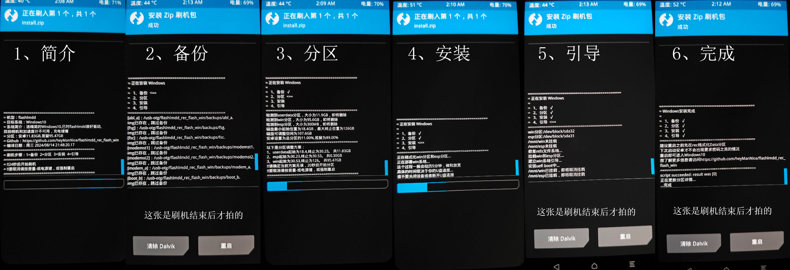

# flashlmdd_rec_flash_win
## 选择你的语言
[`English`](./README.md) | 中文简体
## 简介
LGv50刷windows双系统的卡刷包脚本代码，可以自定义配置安卓和win的磁盘空间  

其他机型仓库：  
- [flashlmdd(lgv50)](https://github.com/heyManNice/flashlmdd_rec_flash_win)  
- [mh2lm5g(lgv50s)](https://github.com/heyManNice/mh2lm5g_rec_flash_win)  
  
为了降低测试成本，脚本应当专机专用  
适配新机型请建立新的Fork  

## 过程图

## 如何刷机
这个脚本目前还在测试阶段  
如果你担心你的lgv50手机损坏先不要刷这个包  
刷机可能会出现意外失败，刷机变砖概不负责  
请确保你有救砖能力再刷这个包
### 准备工作
- 硬件：lgv50手机、otg连接线、8G以上大小U盘
- 软件：flashlmdd_rec_flash_win压缩包
- 手机状态：可以进入第三方rec
### 操作
- 格式化U盘(SD卡)：把U盘(或者SD卡)格式化为exFAT格式，如果已经是这个格式的话可以不用操作
- 复制刷机包：把刷机包中解压出来的的flashlmdd_rec_flash_win文件夹直接放在U盘的根目录
- 配置刷机包：打开flashlmdd_rec_flash_win文件夹,会看到package.info，用记事本打开它
	          里面可以设置是否要分区和安卓与windows的分区大小
	          手机如果是第一次安装windows的话，分区功能必须要打开
- 安装twrp(可选)：推荐使用的rec为v50-twrp-installer-v3.6.0-flashlmdd_ab-by_youngguo(已放入压缩包中)，它是开发过程中测试的环境，兼容性比较好
- 连接U盘(SD卡)：在twrp中把U盘(SD卡)插入手机，用挂载功能把外置U盘挂载上
- 安装Windows：找到/usb-otg/flashlmdd_rec_flash_win/install.zip
	 	像平常刷机一样把它给刷上就好了
## 至开发者
刷机包的结构为：  
flashlmdd_rec_flash_win  
&emsp;&emsp;backups //刷机时备份分区的目录  
&emsp;&emsp;sources //windows资源文件夹   
&emsp;&emsp;&emsp;&emsp;install.wim //windows资源文件夹  
&emsp;&emsp;&emsp;&emsp;uefi.img  //uefi文件  
&emsp;&emsp;install.zip  //刷机脚本文件  
&emsp;&emsp;package.info //刷机包信息和配置文件  

通过替换install.wim可以实现安装任意版本的windows系统

使用`.\build.bat release` 在./package_example下生成install.zip文件  
使用`.\build.bat dev` 在./build下生成test.zip文件，并通过adb推送到手机的/tmp  

## 相关资源
二进制程序：
[bash](https://www.gnu.org/software/bash/bash.html) 
[busybox](https://github.com/meefik/busybox)
[toolbox](/system/bin)
[dos2unix](https://github.com/TizenTeam/dos2unix)
[parted](https://github.com/bcl/parted)
[wimlib-imagex](https://wimlib.net/)
[mkntfs](https://www.tuxera.com/company/open-source/)
[ntfsfix](https://github.com/tuxera/ntfs-3g)
[bcdboot](https://github.com/BigfootACA/bcdboot)
[mkfs.fat](https://github.com/dosfstools/dosfstools)
[7z](https://www.7-zip.org/)
[adb](https://source.android.google.cn/docs/setup/build/adb?hl=zh-cn)

参考教程：
[woa-flashlmdd](https://github.com/n00b69/woa-flashlmdd/tree/main)
[windows-flashable-script](https://github.com/edk2-porting/windows-flashable-script)

woa相关资源：
[msmnilePkg](https://github.com/woa-msmnile/msmnilePkg)
[msmnile-Drivers](https://github.com/woa-msmnile/msmnile-Drivers)

系统镜像：
- [Luo]Windows 10 Pro Arm64 21390.2050.wim  

twrp：
- v50-twrp-installer-v3.6.0-flashlmdd_ab-by_youngguo220102.zip